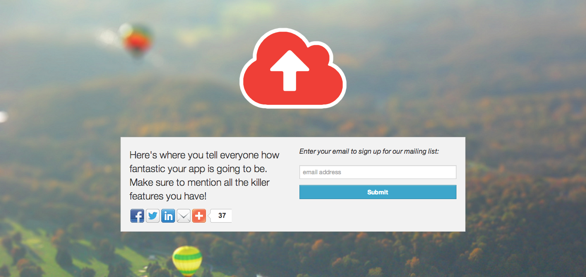

#Launch Page

##Description

Launch Page is a single page site that can be used to gather email addresses from interested parties before your product launches.

##Features

* MailChimp Integration

##Setup

Clone this repo

`git clone git@github.com:davefp/landing_page.git`

Rename `config.yml.example` to `config.yml`

Add your MailChimp API key and list ID to `config/config.yml`

run  `bundle install`

run `bundle exec rackup`

visit [http://localhost:9292](http://localhost:9292)

Done!

##Customization

To change the page background, replace `public/images/background.jpg` with the image you want.

Similarly, replace `public/images/logo.png with your logo.

##Attribution

Default background image "[Tilt Shift Balloon fake miniature (Shawnee, PA)](http://www.flickr.com/photos/27447826@N06/2558540327/in/photostream/)" © 2003 Nick Rossino, used under a Attribution-NonCommercial-ShareAlike 2.0 license: http://creativecommons.org/licenses/by-nc-sa/2.0/

